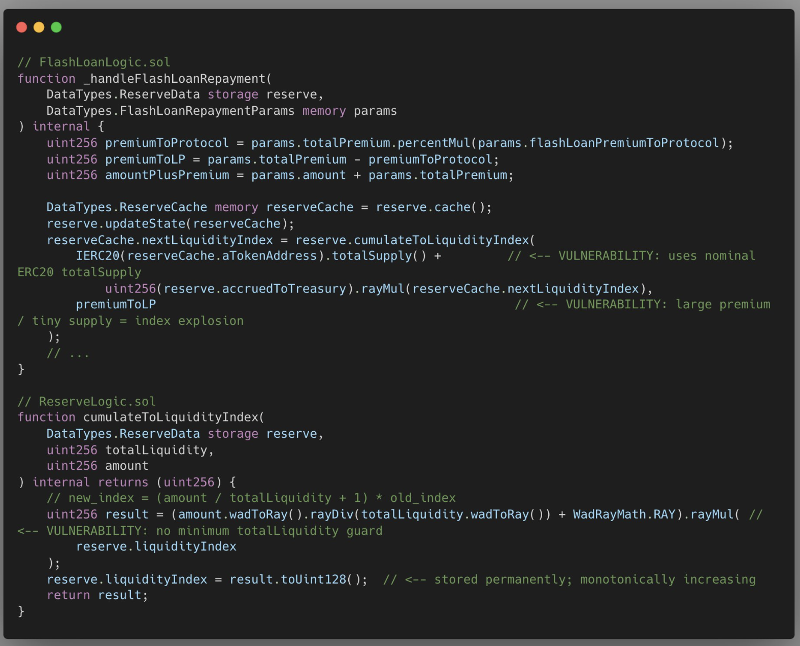

# 2026-03-Recreate-dTRINITY-dLEND-Exploit
Recreate a POC from dTRINITY dLEND exploit, which happened on Ethereum Mainnet on March 2026.

## KeyInfo

- Total Lost                        : ~257,000 dUSD

- Attacker                          : [0x08CfDfF8DEd5f1326628077F38D4f90DF6417fD9](https://etherscan.io/address/0x08CfDfF8DEd5f1326628077F38D4f90DF6417fD9)

- Attack Contract                   : [0xba5e1e36b0305772d35509c694782fb9118d4ecc](https://etherscan.io/address/0xba5e1e36b0305772d35509c694782fb9118d4ecc)

- Vulnerable Contract               :

  - [dLEND Proxy (InitializableImmutableAdminUpgradeabilityProxy)](https://etherscan.io/address/0x6598DaD18Bda89A0E58A1F427c8CeBc0dE90F153)
  - [dLEND-dUSD Interest-Bearing Token](https://etherscan.io/address/0x5CC741931D01Cb1ADdE193222Dfb1ad75930fd60)
  - [dLEND-cbBTC Interest-Bearing Token](https://etherscan.io/address/0x504D0Eacbf9ea5645A8A9da1b15f3708A5483AcC)

- Attack Tx                         :

  - [Inflating Liquidity Index](https://app.blocksec.com/phalcon/explorer/tx/eth/0x8d33d688def03551cb77b0463f55ae5a670f5ebf3bbb5b8aa0e284c040ae7139)
  - [Drained Transaction](https://app.blocksec.com/phalcon/explorer/tx/eth/0xbec4c8ae19c44990984fd41dc7dd1c9a22894adccf31ca6b61b5aa084fc33260)


## Root Cause

- Vulnerability name            : Liquidity Index Manipulation Inflation

- Protocol affected             : [dTRINITY — dLEND lending pool (dLEND-dUSD)](https://etherscan.io/address/0x6598DaD18Bda89A0E58A1F427c8CeBc0dE90F153)

- Root cause                    : The `liquidityIndex` was inflated in a **previous transaction** (`0x8d33d6...`) from its expected value of `1 RAY` up to `6,226,621 RAY`.

  The inflation happens inside `FlashLoanLogic::_handleFlashLoanRepayment`, where `nextLiquidityIndex` is calculated using `totalSupply()` — a value that can be externally manipulated. Because `totalSupply()` was already near zero at the time, the calculation caused a massive spike in the index.

  Once the `liquidityIndex` is inflated, a small deposit of `772,101,004` cbBTC is interpreted as billions of dollars in collateral (phantom collateral), allowing the attacker to borrow the **entire dUSD balance** of the pool in the follow-up transaction.

  
  source from X [Defi_Nerd_sec](https://x.com/Defi_Nerd_sec/status/2034172049300885656/photo/1)

- Broken invariant              : `Sum(Withdraw) <= Sum(Deposit) + Interest`

  A user must never be able to withdraw or borrow more than the total real assets the user deposited into the pool.

- Attack path (step-by-step)    :

  **Tx 1 — Inflate the liquidityIndex (`0x8d33d6...`)**
  1. Manipulate `totalSupply()` to near-zero so `_handleFlashLoanRepayment` computes an astronomically large `nextLiquidityIndex`
  2. `liquidityIndex` is now inflated from `1 RAY` → `6,226,621 RAY`

  **Tx 2 — Drain the pool (`0xbec4c8...`)**
  1. Flash loan `1,136,613,957,271` cbBTC from Morpho Blue
  2. Approve cbBTC → dLEND Proxy
  3. Deposit `772,101,004` cbBTC → phantom collateral created due to inflated index
  4. Borrow entire dUSD balance (`257,328,632,216,555,425,511,184`) against phantom collateral
  5. Deploy `AttackHelper`, transfer cbBTC to it
  6. `AttackHelper` loops: `deposit(HELPER_FIRST_DEPOSIT)` then repeatedly `withdraw(WITHDRAW_AMT)` + `deposit(HELPER_DEPOSIT)` until cbBTC pool is drained, then final withdraw of remainder
  7. Transfer all cbBTC back to main contract
  8. Repay cbBTC flash loan to Morpho Blue
  9. Transfer dUSD profit to EOA attacker

- Prevention / mitigation       : Change the `nextLiquidityIndex` calculation formula in `FlashLoanLogic::_handleFlashLoanRepayment` to not rely on `totalSupply()`, since it can be manipulated to near-zero. A virtual balance offset would prevent the index from being inflated to extreme values even when `totalSupply()` approaches zero.


## Analysis

- Post-mortem : none

- Twitter     :
  - https://x.com/DefimonAlerts/status/2033868831504965995
  - https://x.com/Defi_Nerd_sec/status/2034171592977355111


## Run the POC

To run the POC please copy the `dTrinity_exploit.t.sol` file to your Foundry project `test` folder.
Don't forget to change your RPC URL too.

Then run it on terminal with this command:

```bash
forge test --mp test/2026-03/dTrinity/dTrinity_exploit.t.sol -vv
```


## Test Output

```bash
Ran 1 test for test/2026-03/dTrinity/dTrinity_exploit.t.sol:dTrinityExploit
[PASS] test_dTrinityExploit() (gas: 11356998)
Logs:
  ------------------------------------------------------------------------
  [START ] EOA Attacker dUSD Balances: 0.000000000000000000
  ------------------------------------------------------------------------
  ------------------------------------------------------------------------
  [START ] Contract Victim dUSD Balances: 257328.632216555425511184
  ------------------------------------------------------------------------
  |
  0. With Previous Transaction, the LiquidityIndex that should be 1 RAY, its inflated into 6226621 RAY
  You can check the prev transaction on: 0x8d33d688def03551cb77b0463f55ae5a670f5ebf3bbb5b8aa0e284c040ae7139
  So here we assume that the LiquidityIndex already inflated, and the next attack occur
  |
  1. Flash loan 1136613957271 cbBTC from Morpho Blue
  |
  2. Approve cbBTC -> dLEND and deposit 772101004 cbBTC
  |
  3. Phantom collateral created: 56922952945552
     Available to borrow: 41553755650253
  |
  4. Borrow 257328632216555425511184 dUSD against phantom collateral
  |
  5. Begin the attack on the Helper Contract
  |
  6. Repay cbBTC flash loan to Morpho Blue
  |
  7. Transfer dUSD profit to sender: 257328632216555425511184
  |
  ------------------------------------------------------------------------
  [FINISH] EOA Attacker dUSD Balances: 257328.632216555425511184
  ------------------------------------------------------------------------
  ------------------------------------------------------------------------
  [FINISH] Contract Victim dUSD Balances: 0.000000000000000000
  ------------------------------------------------------------------------

Suite result: ok. 1 passed; 0 failed; 0 skipped; finished in 966.63ms (32.03ms CPU time)

Ran 1 test suite in 976.07ms (966.63ms CPU time): 1 tests passed, 0 failed, 0 skipped (1 total tests)
```